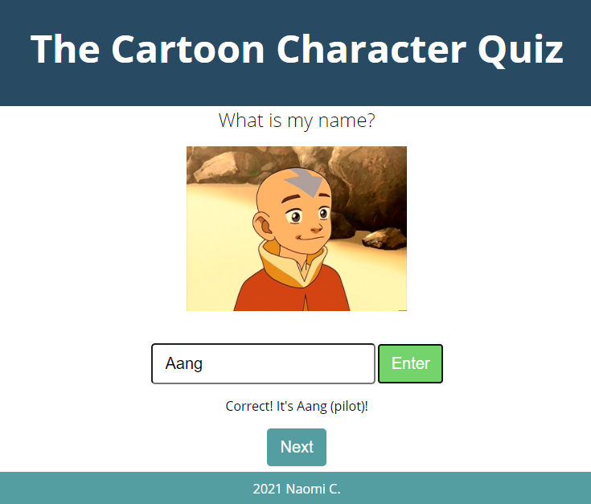

# The Cartoon Character Quiz

## Overview
This project was part of a hackathon with Mintbean and StepZen using #GraphQL. The challenge was to learn how to build a GraphQL API Stepzen.
The Cartoon Character Quiz is a game where you guess the cartoon character's name.

Live Demo: [The Cartoon Character Quiz](https://naomi-rc.github.io/CartoonCharacterQuiz/index.html)

## Technologies used
[Stepzen](https://stepzen.com/), [GraphQl](https://graphql.org/), [Last Airbender API](https://github.com/paigeegorry/last-airbender-api)

## Acknowledgements
Thanks to [Mintbean](https://mintbean.io/) and the [Stepzen](https://stepzen.com/) team for hosting this hackathon.